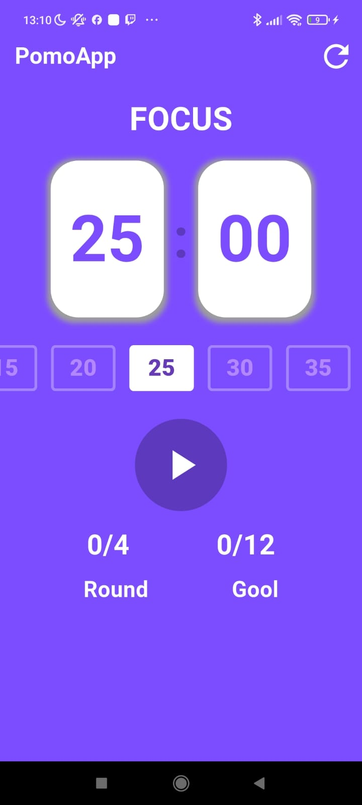
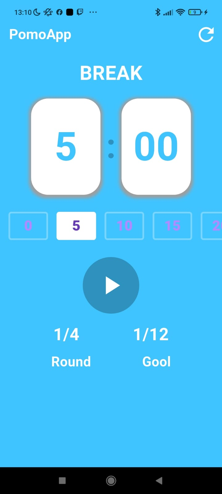

# contadorPomodoro

## Descripcion del proyecto

Contador Pomodoro es una aplicación desarrollada con Flutter que te ayuda a mejorar tu concentración y productividad aplicando la técnica Pomodoro.
El método consiste en alternar rondas de estudio con breves descansos para mantener el enfoque y evitar el agotamiento mental.
Por ejemplo:

25 minutos de estudio

5 minutos de descanso

Cada 3 rondas, se realiza un descanso más largo de 10 minutos.

# Tecnologias

Dart

Flutter

Provider (para la gestión del estado)

Google Fonts

# Descargala📲 Para android

 Link_apk: https://drive.google.com/file/d/1aOIEg5f9u6bXJkn5KIyJpjk7Cyk3GVVR/view?usp=sharing

## 📸 Screenshots

  
  

